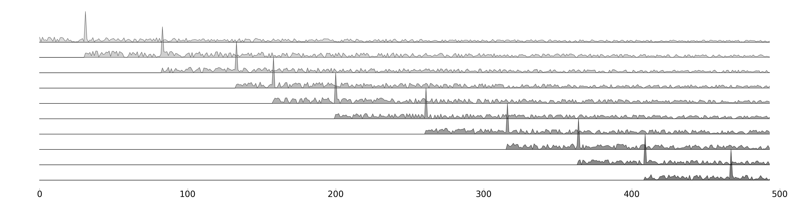
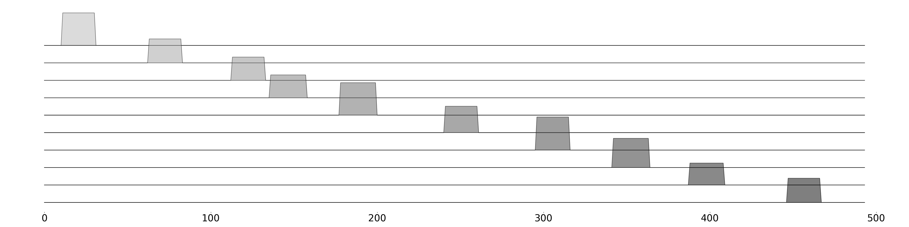

# :anchor: SeqAnchor :anchor:

This is a toy demo using the ASM network structure to learn a set of patterns that captures biological sequence homology and use the model to do Multiple Sequence Alignment (MSA). The model will be trained in an unsupervised way by manipulating the 3rd and 4th standardized moments of the channel activation distribution. Patterns are forced to find their best matches on different inputs in the same order without overlapping.





## Python Virtualenv Preparation
Install virtualenv for python3
```
sudo pip3 install virtualenv
```
Create a virtual environment named venv3 or prefered directory
```
virtualenv -p python3 ~/venv3
```
Activate the python virtual environment and install packages.
```
source ./venv3/bin/activate
pip install -r environment.txt
```
Use the 'setup.py' script build the Cython program 'ASM.so'
```
cd src
python setup.py build_ext --inplace
```

